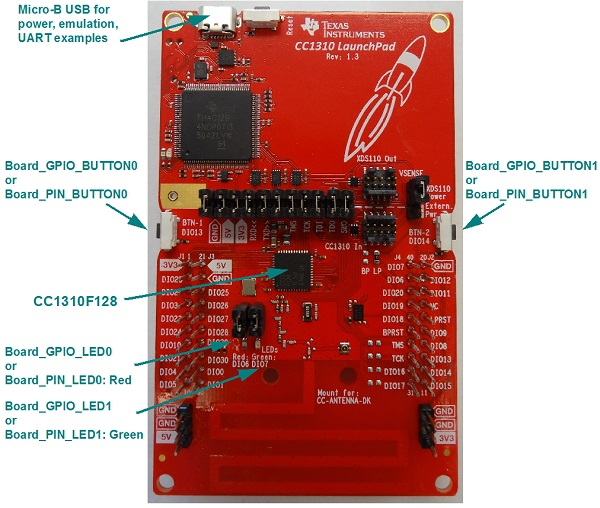

# CC1310 SimpleLink LaunchPad Settings & Resources

The CC1310 LaunchPad consists of a LaunchPad board with a CC1310EM
(CC1310F128 device).

{width="60%"}

## Jumper Settings

* For any examples that use LEDs, make sure the LED’s jumper settings are
closed.

## Board resources used in driver examples

The following table lists the Board names of the resources used by
the driver examples, and their corresponding pins.  Note that there may be
other resources configured in the board files that are not used by any
driver example.  Only the example resources are listed in the table.

  |Board Resource|Pin|
  |--------------|:---|
  |`Board_ADC0`|Connected to ADCVSS internal reference signal. No pin connection required.|
  |`Board_ADC1`|Connected to ADCVDDS internal reference signal. No pin connection required.|
  |`Board_GPIO_BUTTON0`|DIO13|
  |`Board_GPIO_BUTTON1`|DIO14|
  |`Board_GPIO_LED0`|DIO7  (Green - must be jumpered)|
  |`Board_GPIO_LED1`|DIO6  (Red - must be jumpered)|
  |`Board_I2C_TMP`|DIO4, DIO5|
  |`Board_PIN_LED0`|DIO7  (Green - must be jumpered)|
  |`Board_PIN_LED1`|DIO6  (Red - must be jumpered)|
  |`Board_PIN_LED2`|DIO7  (Green - must be jumpered)|
  |`Board_PIN_BUTTON0`|DIO13|
  |`Board_PIN_BUTTON1`|DIO14|
  |`Board_PWM0`|DIO6|
  |`Board_PWM1`|DIO7|
  |`Board_SPI0`|DIO8, DIO9, DIO10|
  |`Board_UART0`|DIO2, DIO3|

## Booster packs

The following examples require booster packs.

  |Example|Booster Pack|
  |-------|:------------|
  |display|[430BOOST-SHARP96 LCD BoosterPack](https://store.ti.com/430boost-sharp96.aspx)|
  |i2ctmp007|[BOOSTXL-SENSORS Sensors BoosterPack](http://www.ti.com/tool/boostxl-sensors)|

## ADC examples pin connections

There is no need to connect the analog input pins to a sampling source on
the CC1310LP.  The examples use an internal reference signal as the sampling
source.

## Peripherals Used

The following list shows which CC1310LP peripherals are used by driver and kernel applications. Driver examples control which peripherals (and which ports) are used.

* __TI-RTOS Kernel (SYS/BIOS).__ Uses the CC13xx’s RTC timer and that timer's associated interrupts. The TI-RTOS Kernel manages the Interrupt Vector Table.
* __Drivers.__
    * __Crypto:__ A CC13xx/CC26xx specific driver that uses the onboard AES Cryptoprocessor.
    * __PINs:__ A CC13xx/CC26xx specific PIN driver that uses 2 output pins for the onboard LEDs and 2 input pins for buttons `Board_PIN_BUTTON0` and `Board_PIN_BUTTON1`.
    * __I2C:__ The I2C driver is configured on I2C0.
    * __RF:__ The RF driver uses the on-chip radio module on CC13xx devices.
    * __UART:__ The UART driver uses UART0, which is attached to the XDS110 USB emulator to facilitate serial communications.
    * __SPI:__ The SPI driver uses SPI0 for `Board_SPI0`.
    * __Watchdog.__ The Watchdog driver example uses the Watchdog Timer WDT peripheral (`Board_WATCHDOG0`).

